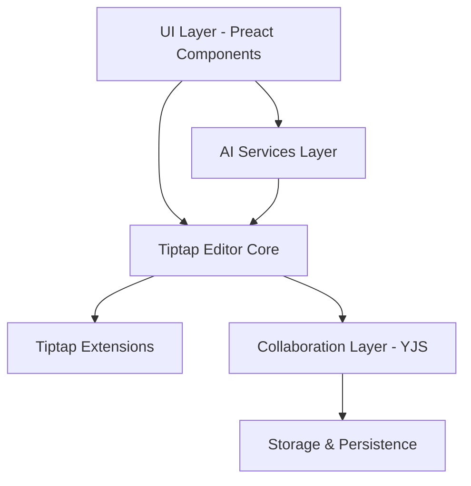

# Tiptop Rich Text Editor - Design Document

## Overview

Tiptop is a modern, AI-enhanced collaborative rich text editor built on Tiptap's extensible framework using Preact for the UI layer. The architecture follows a modular design pattern with clear separation of concerns between the editor core, AI services, collaboration layer, and UI components. The system is designed to be performant, accessible, and highly customizable while maintaining a clean developer experience.

## Architecture

### High-Level Architecture



### Core Architecture Principles

1. **Modular Design**: Each feature is implemented as a separate module with clear interfaces
2. **Extension-Based**: Leverages Tiptap's extension system for all functionality
3. **Type Safety**: Full TypeScript implementation with strict typing
4. **Performance First**: Optimized for large documents and real-time collaboration
5. **Accessibility**: WCAG 2.1 AA compliance throughout

## Build System and Project Structure

### Build Configuration

The project uses **Vite** as the primary build tool and bundler, providing:
- Fast development server with Hot Module Replacement (HMR)
- Optimized production builds with tree-shaking
- TypeScript support out of the box
- Plugin ecosystem for Preact and Tailwind CSS integration
- Built-in support for modern JavaScript features

### Project Structure
```
tiptop/
├── src/
│   ├── components/          # Preact UI components
│   ├── extensions/          # Custom Tiptap extensions
│   ├── services/           # AI and collaboration services
│   ├── utils/              # Helper functions and utilities
│   ├── types/              # TypeScript type definitions
│   ├── styles/             # Tailwind CSS and custom styles
│   └── main.tsx            # Application entry point
├── tests/                  # Test files (parallel to src)
│   ├── unit/               # Unit tests
│   ├── integration/        # Integration tests
│   └── e2e/                # End-to-end tests
├── public/                 # Static assets
├── vite.config.ts          # Vite configuration
├── tailwind.config.js      # Tailwind CSS configuration
└── package.json            # Dependencies and scripts
```

### Vite Configuration
```typescript
// vite.config.ts
import { defineConfig } from 'vite';
import preact from '@preact/preset-vite';
import { resolve } from 'path';

export default defineConfig({
  plugins: [preact()],
  resolve: {
    alias: {
      '@': resolve(__dirname, 'src'),
      '@tests': resolve(__dirname, 'tests')
    }
  },
  build: {
    lib: {
      entry: resolve(__dirname, 'src/main.tsx'),
      name: 'Tiptop',
      fileName: 'tiptop'
    },
    rollupOptions: {
      external: ['preact', 'preact/hooks'],
      output: {
        globals: {
          preact: 'preact',
          'preact/hooks': 'preactHooks'
        }
      }
    }
  },
  test: {
    globals: true,
    environment: 'jsdom',
    setupFiles: ['./tests/setup.ts']
  }
});
```

## Components and Interfaces

### Core Components

#### 1. TiptopEditor Component
```typescript
interface TiptopEditorProps {
  content?: string;
  editable?: boolean;
  collaborative?: boolean;
  aiEnabled?: boolean;
  theme?: 'light' | 'dark' | 'auto';
  onUpdate?: (content: string) => void;
  onSelectionUpdate?: (selection: Selection) => void;
  extensions?: Extension[];
  className?: string;
}
```

#### 2. Toolbar Components
- **MainToolbar**: Primary formatting controls
- **FloatingToolbar**: Context-sensitive selection toolbar  
- **BubbleMenu**: Inline formatting options
- **SlashMenu**: Command palette for quick actions

#### 3. AI Integration Components
- **AIAssistant**: Main AI interaction interface
- **AIImageGenerator**: Image generation dialog
- **AIDocumentGenerator**: Document creation assistant
- **AIEditingSuggestions**: Inline editing recommendations

#### 4. Collaboration Components
- **CollaborationProvider**: YJS integration wrapper
- **UserCursors**: Real-time cursor display
- **CommentSystem**: Inline commenting interface
- **PresenceIndicator**: Active users display

### Extension Architecture

#### Core Extensions (from @tiptap packages)
```typescript
// Text formatting extensions
- @tiptap/extension-bold
- @tiptap/extension-italic
- @tiptap/extension-underline
- @tiptap/extension-strike
- @tiptap/extension-subscript
- @tiptap/extension-superscript
- @tiptap/extension-text-style
- @tiptap/extension-color
- @tiptap/extension-highlight

// Structure extensions
- @tiptap/extension-bullet-list
- @tiptap/extension-ordered-list
- @tiptap/extension-list-item
- @tiptap/extension-blockquote
- @tiptap/extension-code-block
- @tiptap/extension-text-align

// Media extensions
- @tiptap/extension-image
- @tiptap/extension-link

// Collaboration extensions
- @tiptap/extension-collaboration
- @tiptap/extension-collaboration-cursor
```

#### Custom Extensions
```typescript
// AI-powered extensions
- TiptopAIAssistant
- TiptopImageGenerator
- TiptopCommentSystem
- TiptopAudioEmbed
- TiptopVideoEmbed
- TiptopSyntaxHighlight
```

### State Management

#### Editor State Structure
```typescript
interface TiptopState {
  editor: {
    content: JSONContent;
    selection: Selection;
    isEditable: boolean;
    isFocused: boolean;
  };
  collaboration: {
    isConnected: boolean;
    users: CollaborationUser[];
    comments: Comment[];
  };
  ai: {
    isProcessing: boolean;
    suggestions: AISuggestion[];
    generatedContent: GeneratedContent[];
  };
  ui: {
    activeToolbar: string | null;
    selectedText: string;
    contextMenu: ContextMenuState;
  };
}
```

## Data Models

### Core Data Models

#### Document Model
```typescript
interface TiptopDocument {
  id: string;
  title: string;
  content: JSONContent;
  metadata: DocumentMetadata;
  collaborators: Collaborator[];
  comments: Comment[];
  version: number;
  createdAt: Date;
  updatedAt: Date;
}

interface DocumentMetadata {
  wordCount: number;
  readingTime: number;
  language: string;
  tags: string[];
  aiGenerated: boolean;
}
```

#### Comment Model
```typescript
interface Comment {
  id: string;
  documentId: string;
  userId: string;
  content: string;
  position: CommentPosition;
  thread: CommentReply[];
  resolved: boolean;
  createdAt: Date;
  updatedAt: Date;
}

interface CommentPosition {
  from: number;
  to: number;
  text: string;
}
```

#### AI Integration Models
```typescript
interface AIRequest {
  type: 'edit' | 'generate' | 'image' | 'translate';
  content: string;
  context: string;
  parameters: AIParameters;
}

interface AIResponse {
  id: string;
  type: AIRequest['type'];
  result: string | GeneratedImage;
  confidence: number;
  alternatives?: string[];
}
```

### Collaboration Models

#### User Presence
```typescript
interface CollaborationUser {
  id: string;
  name: string;
  avatar?: string;
  cursor: CursorPosition;
  selection: SelectionRange;
  color: string;
  isActive: boolean;
}
```

## Error Handling

### Error Categories

1. **Network Errors**: Connection failures, sync issues
2. **AI Service Errors**: API failures, rate limiting
3. **Validation Errors**: Invalid content, malformed data
4. **Collaboration Errors**: Conflict resolution, user management
5. **Media Errors**: Upload failures, unsupported formats

### Error Handling Strategy

```typescript
interface TiptopError {
  code: string;
  message: string;
  category: ErrorCategory;
  recoverable: boolean;
  context?: Record<string, any>;
}

class TiptopErrorHandler {
  handleError(error: TiptopError): void;
  retryOperation(operation: () => Promise<any>): Promise<any>;
  showUserNotification(error: TiptopError): void;
}
```

### Resilience Patterns

1. **Retry Logic**: Exponential backoff for network operations
2. **Graceful Degradation**: Fallback modes when services are unavailable
3. **Offline Support**: Local storage and sync when reconnected
4. **Error Boundaries**: Preact error boundaries for component isolation

## Testing Strategy

### Unit Testing
- **Component Testing**: Preact Testing Library for UI components
- **Extension Testing**: Tiptap testing utilities for custom extensions
- **Utility Testing**: Jest for helper functions and utilities
- **AI Integration Testing**: Mock services for AI functionality

### Integration Testing
- **Editor Integration**: Full editor workflow testing
- **Collaboration Testing**: Multi-user scenario simulation
- **AI Feature Testing**: End-to-end AI workflow validation

### End-to-End Testing (Playwright)
```typescript
// Test scenarios
- Basic editing workflows
- Collaborative editing sessions
- AI-assisted content creation
- Media insertion and management
- Comment system functionality
- Accessibility compliance
- Performance benchmarks
```

### Performance Testing
- **Load Testing**: Large document handling
- **Collaboration Stress Testing**: Multiple concurrent users
- **Memory Usage**: Long-running session monitoring
- **Network Optimization**: Bandwidth usage analysis

## AI Services Integration

### AI Service Architecture
```typescript
interface AIService {
  textGeneration: TextGenerationService;
  imageGeneration: ImageGenerationService;
  textAnalysis: TextAnalysisService;
  translation: TranslationService;
}

interface TextGenerationService {
  generateText(prompt: string, context: string): Promise<string>;
  improveText(text: string, style: string): Promise<string>;
  summarizeText(text: string): Promise<string>;
}
```

### AI Integration Points
1. **Inline Suggestions**: Real-time writing assistance
2. **Content Generation**: On-demand content creation
3. **Image Generation**: AI-powered visual content
4. **Document Analysis**: Content insights and recommendations

## Styling and Theming

### Tailwind CSS 4.0 Integration
- **Design System**: Consistent spacing, colors, typography
- **Dark Mode**: Automatic theme switching
- **Responsive Design**: Mobile-first approach
- **Custom Components**: Styled editor elements

### Theme Structure
```typescript
interface TiptopTheme {
  colors: {
    primary: string;
    secondary: string;
    accent: string;
    background: string;
    surface: string;
    text: string;
  };
  typography: {
    fontFamily: string;
    fontSize: Record<string, string>;
    lineHeight: Record<string, string>;
  };
  spacing: Record<string, string>;
  borderRadius: Record<string, string>;
}
```

## Security Considerations

### Content Security
- **XSS Prevention**: Content sanitization
- **Input Validation**: Strict content validation
- **File Upload Security**: Type and size restrictions

### Collaboration Security
- **Authentication**: User verification
- **Authorization**: Permission-based access
- **Data Encryption**: End-to-end encryption for sensitive content

### AI Security
- **Prompt Injection Prevention**: Input sanitization
- **Rate Limiting**: API usage controls
- **Data Privacy**: No sensitive data in AI requests

## Performance Optimization

### Editor Performance
- **Virtual Scrolling**: Large document optimization
- **Lazy Loading**: On-demand extension loading
- **Debounced Updates**: Optimized change handling
- **Memory Management**: Efficient cleanup

### Collaboration Performance
- **Operational Transform**: Efficient conflict resolution
- **Delta Compression**: Minimized network traffic
- **Connection Pooling**: Optimized WebSocket usage

### AI Performance
- **Request Batching**: Grouped AI operations
- **Caching**: Response caching for common requests
- **Streaming**: Real-time response handling